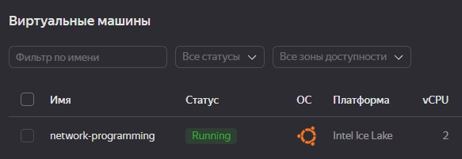
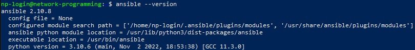
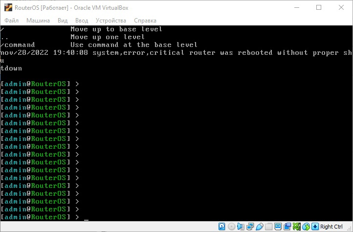
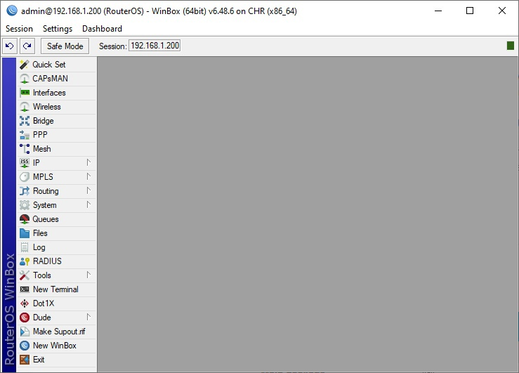
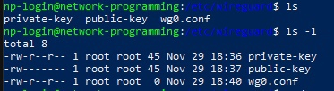
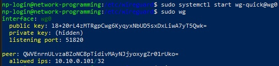
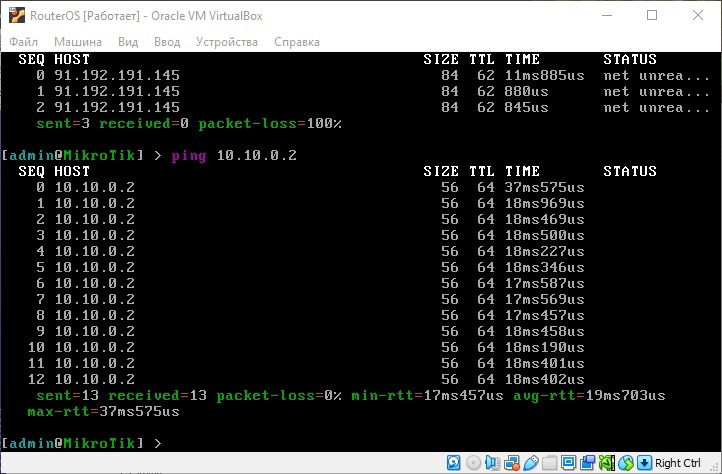
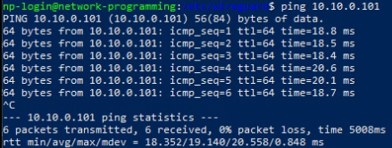

University: ITMO University  
Faculty: FICT  
Course: Network programming  
Year: 2022  
Group: K34202  
Author: Efimov Pavel Leonidovich  
Lab: Lab1  
Date of create: 28.11.2022  
Date of finished:  

Цель работы: Развернуть виртуальную машину на базе платформы Yandex Cloud с установленной системой контроля конфигураций Ansible и установка CHR в VirtualBox

Ход работы:
1. Создана виртуальная машина на Yandex Cloud  

2. Было реализовано подключение по ssh, установлен ansible

3. Был установлен RouterOS версии 7.6 в VirtualBox.

4. Установлен WinBox для работы с MikroTik на виртуальной машине.

5. Был выбран VPN WireGuard. VPN был установлен в MikroTik и на удаленный сервер.

6. Были настроены интерфейсы и пиры для работы VPN, также был запущен VPN

7. Была проверена работа VPN на MikroTik и удаленном сервере.

Вывод:
В ходе выполнения работы были развернуты виртуальные машины на базе платформы Yandex Cloud с установленной системой контроля конфигураций Ansible и установлен CHR в VirtualBox. 
